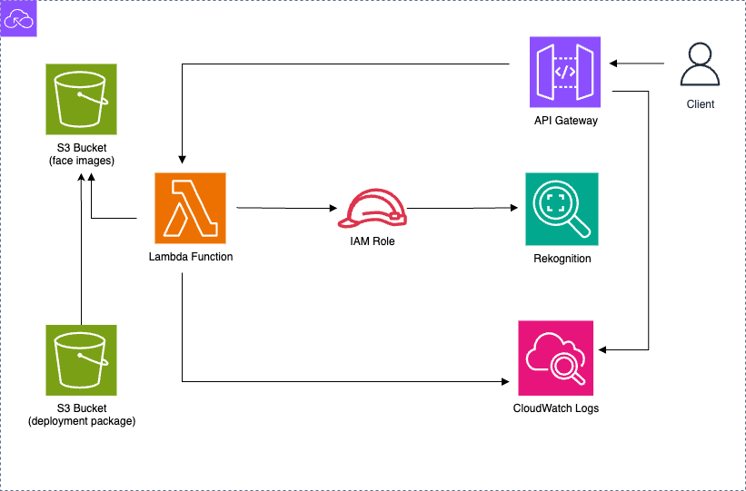

# Serverless Face Detection API

This project deploys a fully serverless architecture using AWS to detect faces in images using the AWS Rekognition services. The system accepts HTTPS requests via an API Gateway, that invokes a Lambda function, and processes the image stored in a S3 bucket. The infrastructure is provisioned using Terraform.

---

## 🧱 Architecture Overview



Client → API Gateway → Lambda Function → IAM Role → Rekognition
↓
S3 (face images)
↓
CloudWatch Logs (for Lambda/API)
S3 (deployment package)

**Key Components**:
- **API Gateway** – Exposes a REST endpoint for submitting image data.
- **Lambda Function** – Handles incoming requests and calls Rekognition to detect faces.
- **S3 Buckets** – 
  - One bucket stores input face images.
  - One bucket stores the deployment package (ZIP archive).
- **IAM Role** – Grants Lambda permission to access S3, Rekognition, and CloudWatch Logs.
- **CloudWatch Logs** – Captures execution logs from Lambda and API Gateway for monitoring and debugging.

---

## 🧰 Project Structure

face_detection_api/
├── modules/
│   ├── api/
│   │   ├── api.tf
│   │   ├── variables.tf
│   │   └── outputs.tf
│   ├── iam/
│   │   ├── iam.tf
│   │   ├── variables.tf
│   │   └── outputs.tf
│   ├── lambda/
│   │   ├── lambda.tf
│   │   ├── detect_faces.py
│   │   ├── outputs.tf
│   │   └── variables.tf
├── main.tf
├── outputs.tf
├── providers.tf
└── README.md

## 🛠️ Stack

- **Terraform**: Infrastructure as Code
- **AWS Lambda**: Python function for face detection
- **Amazon S3**: 
  - One bucket for face image uploads
  - One bucket for Lambda deployment packages
- **Amazon Rekognition**: Face detection
- **API Gateway (HTTP API)**: Public REST endpoint

---

---

## 🚀 Deployment

### Prerequisites

- [Terraform](https://www.terraform.io/downloads.html) v1.3+
- AWS CLI configured with appropriate credentials
- Python 3.x

### 1. Package the Lambda Function

```bash
cd modules/lambda
zip face-detection-handler.zip detect_faces.py

cd face_detection_api
terraform init
terraform plan
terraform apply
Once deployed, you can send a POST request to the API Gateway endpoint:
curl -X POST https://YOUR-API-ID.execute-api.region.amazonaws.com/default/detect \
  -H "Content-Type: application/json" \
  -d '{"image": "sample.jpg", "bucket": "faces-detect-images-bucket"}'
  Make sure an example.jpg exists in the S3 (face images) bucket

